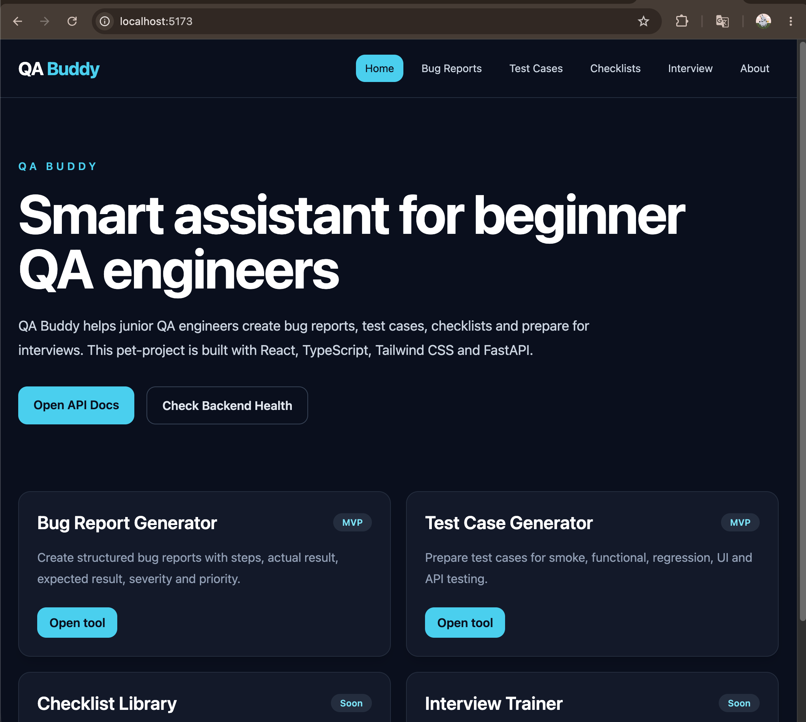
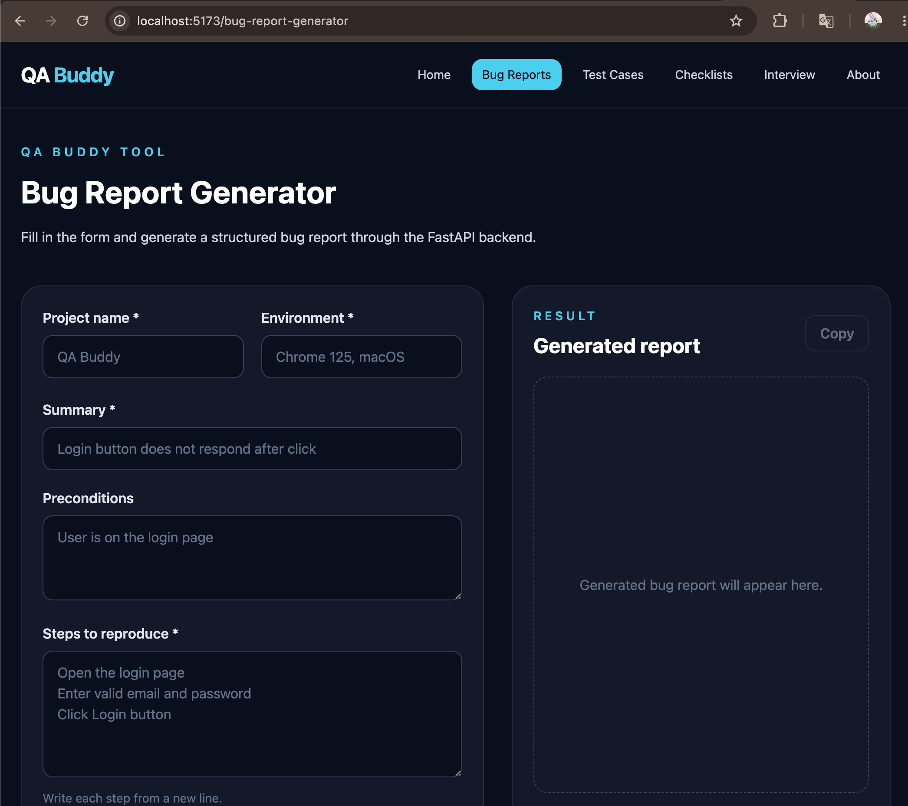
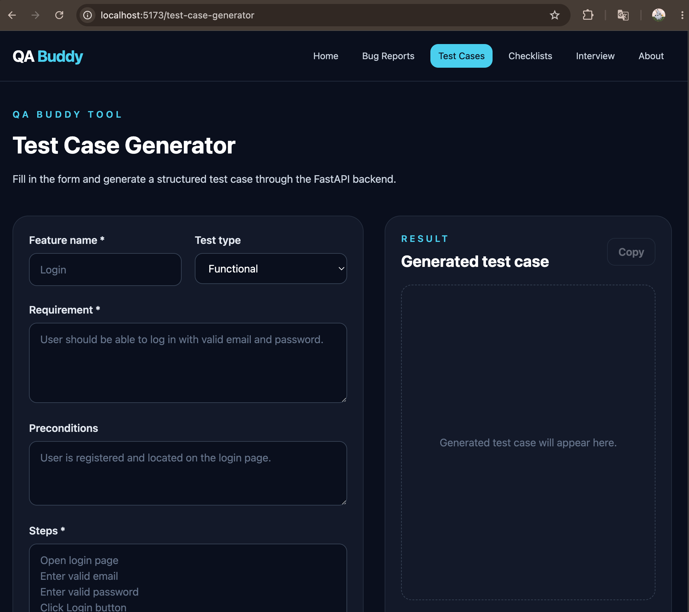
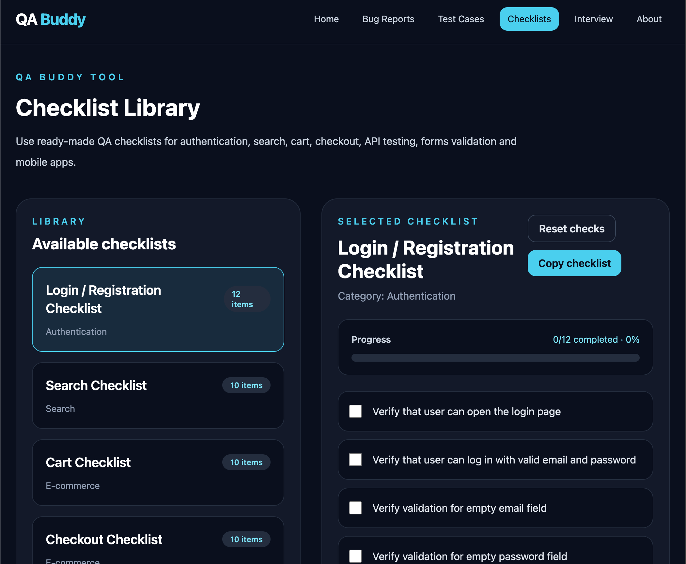
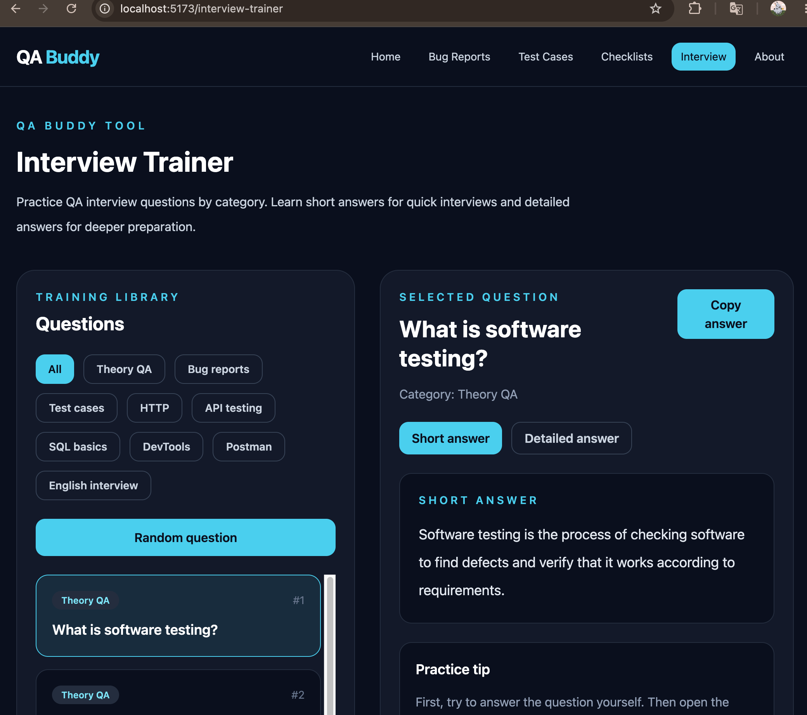
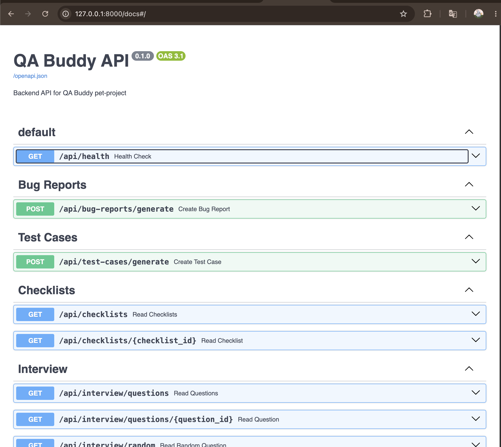
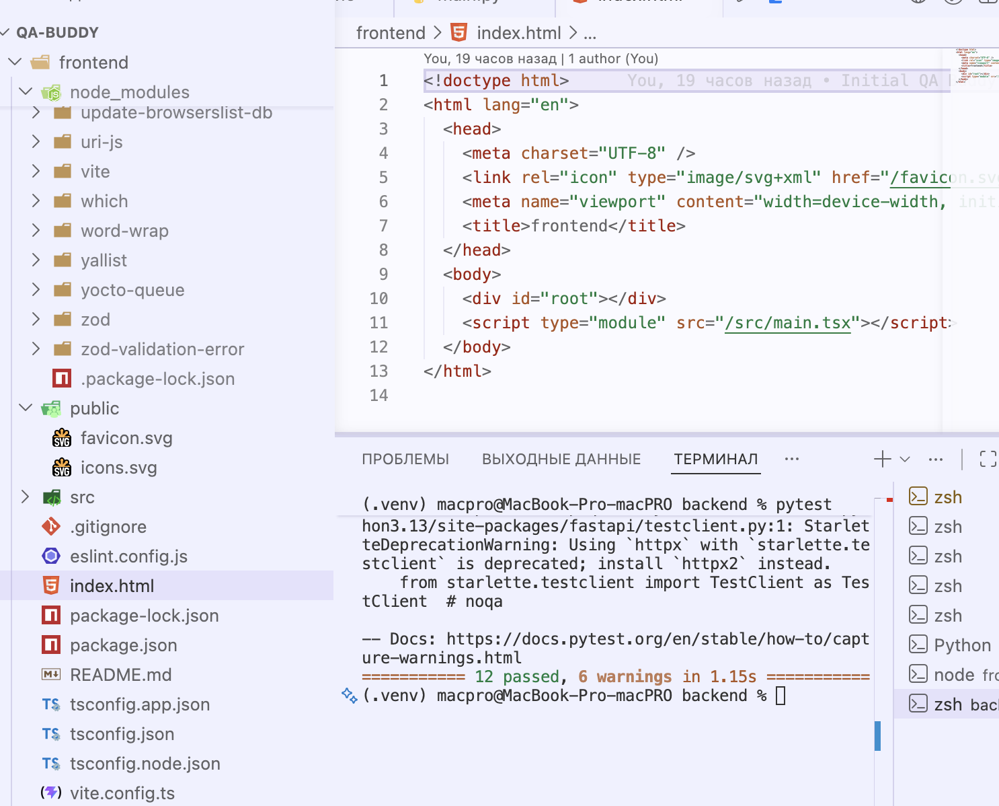

# QA Buddy

  
  
  
  
  
  
  
  

QA Buddy is a fullstack pet-project for beginner QA engineers.

The application helps junior QA engineers create bug reports, generate test cases, use QA checklists and prepare for QA interviews.

## Project Goal

The main goal of QA Buddy is to demonstrate practical skills in:

- manual QA documentation
- API testing
- frontend development
- backend development
- automated backend testing
- Git and GitHub workflow

## Tech Stack

### Frontend

- React
- TypeScript
- Tailwind CSS
- Vite
- React Router

### Backend

- Python
- FastAPI
- Pydantic
- Uvicorn
- JSON files as temporary storage

### Testing

- Pytest
- FastAPI TestClient
- Swagger
- Browser testing
- DevTools

## Implemented Features

### Bug Report Generator

The user can fill in bug report fields and generate a structured bug report.

Fields:

- project name
- environment
- summary
- preconditions
- steps to reproduce
- actual result
- expected result
- severity
- priority
- attachment link

### Test Case Generator

The user can generate a structured test case.

Fields:

- feature name
- requirement
- preconditions
- steps
- expected result
- test type
- priority

### Checklist Library

The user can open ready-made QA checklists, mark items as completed, reset progress and copy checklist content.

Current checklist categories:

- Login / Registration
- Search
- Cart
- Checkout
- API Testing
- Forms Validation
- Mobile App

### Interview Trainer

The user can practice QA interview questions by category.

Current categories:

- Theory QA
- Bug reports
- Test cases
- HTTP
- API testing
- SQL basics
- DevTools
- Postman
- English interview

## API Endpoints

Health check:

- GET /api/health

Bug reports:

- POST /api/bug-reports/generate

Test cases:

- POST /api/test-cases/generate

Checklists:

- GET /api/checklists
- GET /api/checklists/{checklist_id}

Interview:

- GET /api/interview/questions
- GET /api/interview/questions/{question_id}
- GET /api/interview/random

## How to Run Backend

Go to backend folder:

    cd backend

Create and activate virtual environment:

    python3 -m venv .venv
    source .venv/bin/activate

Install dependencies:

    pip install -r requirements.txt

Run backend:

    uvicorn app.main:app --reload --reload-dir app

Backend URL:

    http://127.0.0.1:8000

Swagger:

    http://127.0.0.1:8000/docs

## How to Run Frontend

Go to frontend folder:

    cd frontend

Install dependencies:

    npm install

Run frontend:

    npm run dev

Frontend URL will be shown in terminal, for example:

    http://localhost:5173

## How to Run Tests

Go to backend folder:

    cd backend
    source .venv/bin/activate
    pytest

Current backend tests cover:

- health endpoint
- bug report generation
- test case generation
- checklist endpoints
- interview endpoints
- validation errors
- 404 errors

## Project Structure

    qa-buddy/
    ├── backend/
    │   ├── app/
    │   │   ├── api/
    │   │   ├── data/
    │   │   ├── schemas/
    │   │   ├── services/
    │   │   └── main.py
    │   ├── tests/
    │   └── requirements.txt
    │
    ├── frontend/
    │   ├── src/
    │   │   ├── api/
    │   │   ├── components/
    │   │   ├── data/
    │   │   ├── pages/
    │   │   └── main.tsx
    │   └── package.json
    │
    ├── docs/
    ├── screenshots/
    ├── README.md
    └── .gitignore

## Screenshots

### Home Page

### Bug Report Generator

### Test Case Generator

### Checklist Library

### Interview Trainer

### Swagger API Documentation

### Pytest Result

## Documentation

Project documentation is located in the docs folder:

- requirements_v1.md
- test_plan.md
- api_testing.md
- test_cases.md
- bug_reports.md
- release_notes.md

## Roadmap

Planned improvements:

- add screenshots to README
- add localStorage for checklist progress
- add search and filters
- add more interview questions
- add export to Markdown / PDF
- add SQLite or PostgreSQL
- add authentication
- add deployment

## Author

Katy Peshkun  
GitHub: kitkotcat
