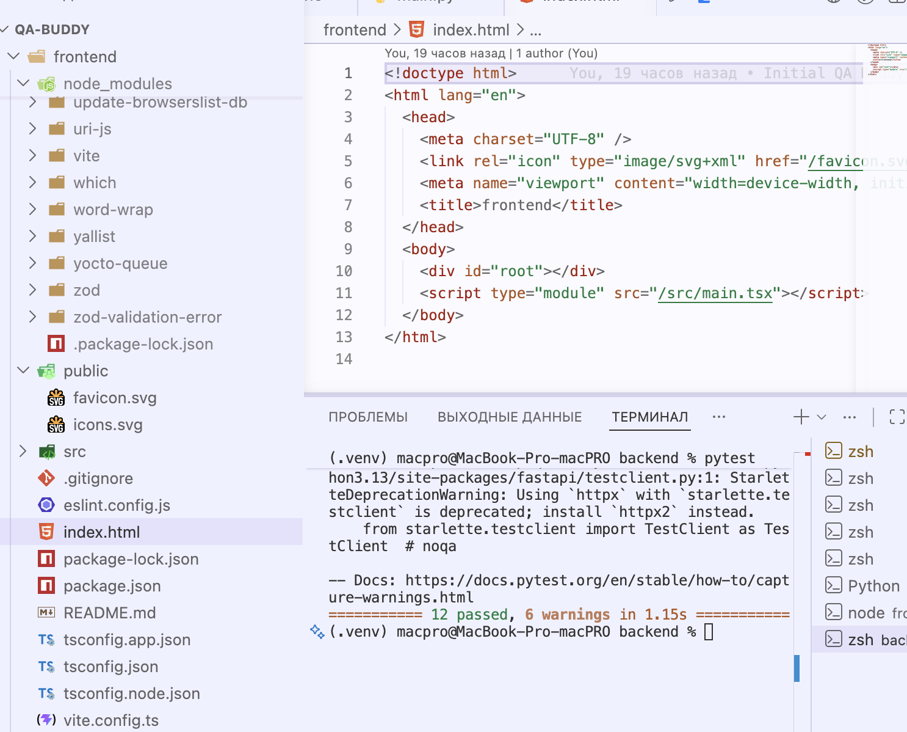

# QA Buddy — QA Portfolio Project

QA Buddy — учебно-практический проект для отработки полного QA workflow на web, REST API/backend и Android: от требований и test design до smoke, regression, API-проверок, automation и release documentation.

Проект включает React web-приложение, FastAPI backend, Android offline MVP и набор QA-артефактов. Recorder вынесен из этого репозитория и продолжил развитие как отдельный проект **QA Cat Recorder**.

## Что проект показывает как QA-портфолио

- functional / smoke / regression / retest testing;
- REST API и backend testing;
- positive / negative scenarios;
- validation и error handling;
- test design и traceable QA documentation;
- localStorage / offline checks;
- bilingual RU/EN checks;
- Android smoke и offline testing;
- Swagger / OpenAPI и Chrome DevTools;
- backend autotests на Python + Pytest;
- CI quality gate для frontend и backend.

## QA coverage

Backend покрыт Pytest-тестами с использованием FastAPI TestClient.

Проверяются:

- health endpoint;
- генерация bug reports;
- генерация test cases;
- checklist endpoints;
- interview endpoints;
- bilingual backend data;
- validation errors;
- not found / 404 scenarios.

Тесты находятся в [`backend/tests`](backend/tests).

### Android / Offline QA Gate

Для Android offline MVP выполнялись:

- frontend production build;
- Android Gradle build;
- APK installation;
- Android smoke testing;
- offline testing.

Подробнее: [`docs/releases/v0.3.0.md`](docs/releases/v0.3.0.md).

## QA-документация

- [Requirements](docs/requirements_v1.md)
- [Test Plan](docs/test_plan.md)
- [API Testing](docs/api_testing.md)
- [Test Cases](docs/test_cases.md)
- [Bug Reports](docs/bug_reports.md)
- [Release Notes v0.1–v0.2](docs/release_notes.md)
- [Release Notes v0.3.0](docs/releases/v0.3.0.md)
- [Privacy Policy RU](docs/legal/PRIVACY_POLICY_RU.md)

## Функциональность приложения

### Bug Report Generator

Формирует структурированный bug report с environment, summary, preconditions, steps to reproduce, actual/expected result, severity и priority. Результаты можно сохранять и экспортировать в Markdown.

### Test Case Generator

Формирует test case с requirement, preconditions, steps, expected result, test type и priority. Результаты можно сохранять и экспортировать в Markdown.

### Checklist Library

Библиотека QA-чек-листов с поиском, сохранением прогресса и reset состояния.

Примеры категорий: Login / Registration, Search, Cart, Checkout, API Testing, Forms Validation, Mobile App.

### Interview Trainer

Тренажёр вопросов для QA-собеседований с короткими и подробными ответами, категориями и RU/EN интерфейсом.

### QA Knowledge Quiz

Android offline версия содержит QA quiz с режимами на 5, 10 и 20 вопросов, статистикой по категориям и разбором ошибок.

## API endpoints

```text
GET  /api/health
POST /api/bug-reports/generate
POST /api/test-cases/generate
GET  /api/checklists
GET  /api/checklists/{checklist_id}
GET  /api/interview/questions
GET  /api/interview/questions/{question_id}
GET  /api/interview/random
```

Swagger после локального запуска backend:

```text
http://127.0.0.1:8000/docs
```

## System under test

| Часть | Технологии |
|---|---|
| Frontend | React, TypeScript, Vite, Tailwind CSS |
| Backend | Python, FastAPI, Pydantic, Uvicorn |
| Backend tests | Pytest, FastAPI TestClient |
| Android | Capacitor, Gradle |
| Local data | localStorage / offline data |
| API documentation | Swagger / OpenAPI |
| CI | GitHub Actions |

## Локальный запуск

### Backend

```bash
cd backend
python3 -m venv .venv
source .venv/bin/activate
pip install -r requirements.txt
uvicorn app.main:app --reload --reload-dir app
```

Backend: `http://127.0.0.1:8000`

### Frontend

```bash
cd frontend
npm ci
npm run dev
```

## Quality gate

### Frontend

```bash
cd frontend
npm ci
npm audit --audit-level=high
npm run lint
npm run build
```

### Backend

```bash
cd backend
source .venv/bin/activate
pytest -q
```

Тот же frontend/backend gate выполняется в GitHub Actions для `main` и pull requests.

## Структура проекта

```text
qa-buddy/
├── .github/workflows/  # CI quality gate
├── backend/            # FastAPI backend + Pytest tests
├── frontend/           # Web UI + Android/Capacitor project
├── docs/               # QA documentation, legal and release notes
├── screenshots/        # UI, Swagger and Pytest evidence
├── scripts/            # Release / Android audit helpers
├── LICENSE
└── README.md
```

## Related project

### QA Cat Recorder

Recorder, который начинался как эксперимент внутри QA Buddy, теперь развивается отдельно как **QA Cat Recorder** — Chrome extension для записи manual QA sessions, Steps, screenshots и Network/Console evidence.


## Screenshots

### Home Page


### Bug Report Generator


### Test Case Generator


### Checklist Library


### Interview Trainer


### Swagger API Documentation


### Pytest Result



## Текущее состояние

В репозитории остаются только актуальные части QA Buddy: web-приложение, FastAPI backend, Android offline MVP, QA-документация, Pytest tests, screenshots и CI quality gate.

Проект используется как практическая площадка для развития manual QA и test automation навыков.

## License

MIT — см. [LICENSE](LICENSE).

## Автор

Екатерина Пешкун  
GitHub: [@kitkotcat](https://github.com/kitkotcat)
