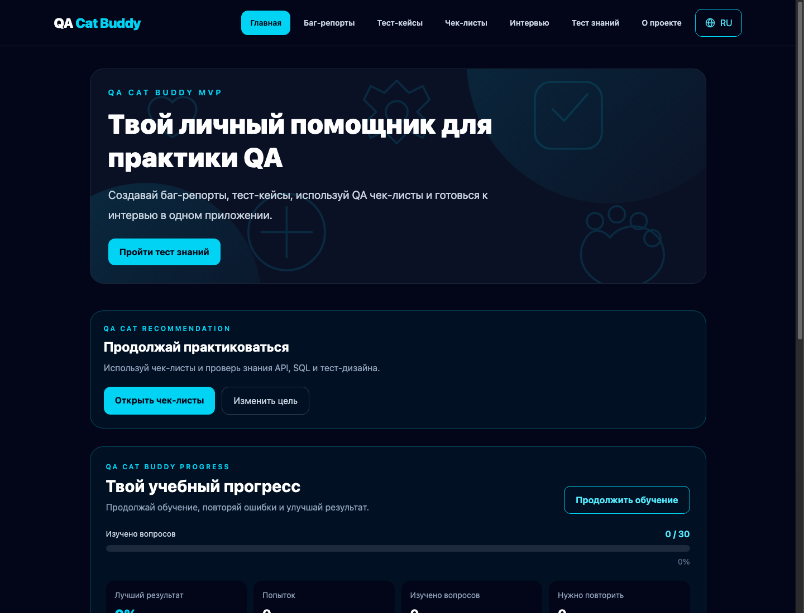
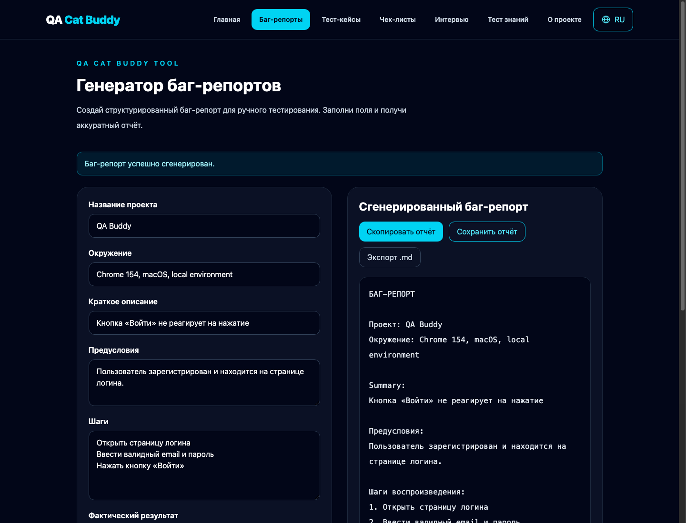
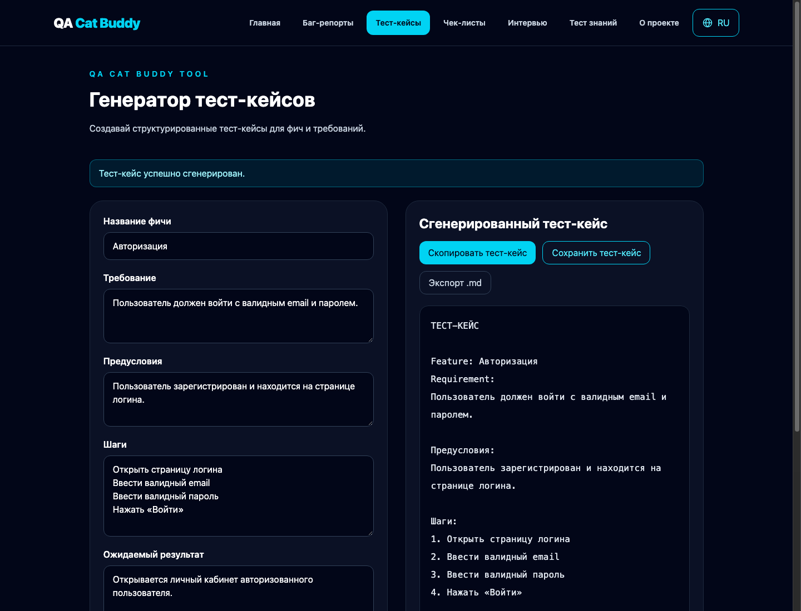
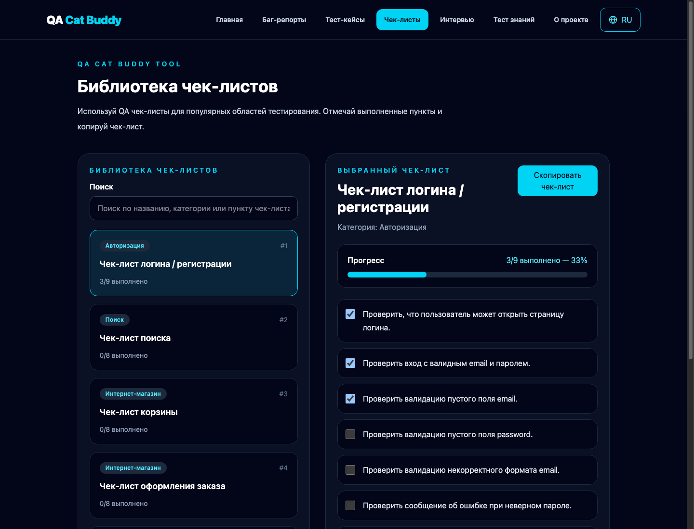
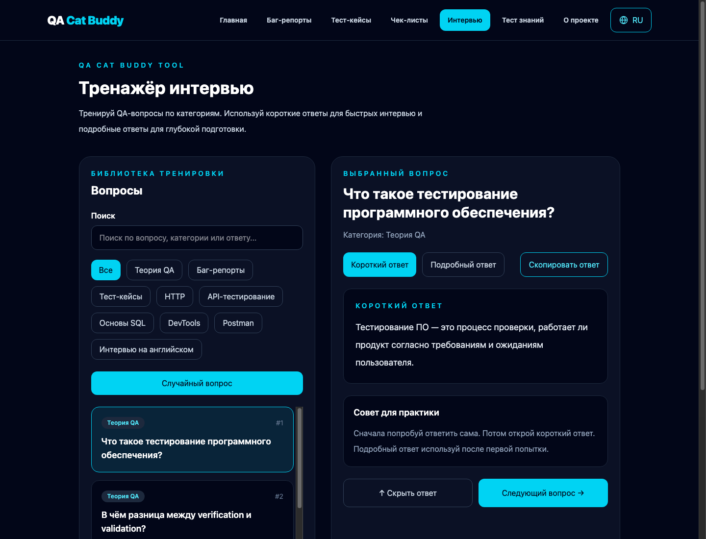
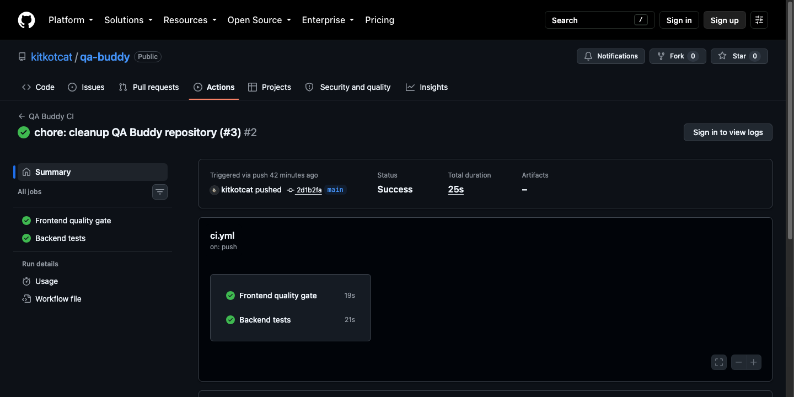
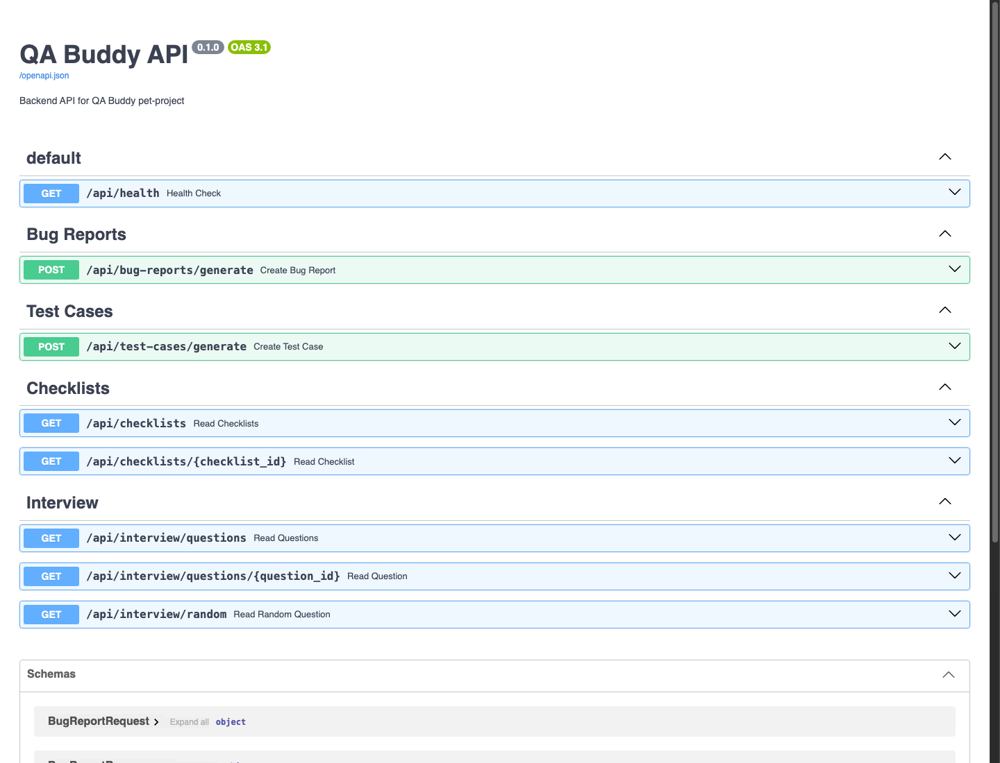

# QA Buddy — QA Portfolio Project

[](https://github.com/kitkotcat/qa-buddy/actions/workflows/ci.yml)


[](LICENSE)

QA Buddy — учебно-практический fullstack-проект для демонстрации полного QA workflow: требования, test design, manual testing, REST API, backend automation, Android/offline checks и CI quality gate.

В интерфейсе используется бренд **QA Cat Buddy**. Приложение работает на русском и английском языках; основной portfolio-flow показан на русском.



## QA focus

| Слой | Что покрыто |
|---|---|
| Web | functional, smoke, regression, retest, localization, localStorage |
| REST API | positive/negative scenarios, validation, status codes, 404 |
| Backend | 15 Pytest tests через FastAPI TestClient |
| Android | build, installation, smoke, offline/persistence checks |
| CI | dependency audit, ESLint, production build, Pytest |
| QA artifacts | requirements, test plan, test cases, bug reports, API testing, release notes |

## Что умеет приложение

- **Bug Report Generator** — формирует структурированные баг-репорты и поддерживает сохранение/Markdown export.
- **Test Case Generator** — создаёт тест-кейсы по требованию, типу и приоритету.
- **Checklist Library** — готовые QA-чек-листы с поиском и сохранением прогресса.
- **Interview Trainer** — вопросы по QA, HTTP, API, SQL, DevTools, Postman и интервью.
- **QA Knowledge Quiz** — учебный quiz с прогрессом и разбором ошибок.
- **RU/EN** — переключение языка интерфейса и backend data.

## Architecture

```text
React + TypeScript + Vite
          |
          | REST / JSON
          v
     FastAPI backend
          |
          +-- QA data / validation
          +-- Pytest coverage

Capacitor / Android
          +-- localStorage / offline data

GitHub Actions
          +-- Frontend: npm audit -> lint -> build
          +-- Backend: pytest
```

## Testing & automation

Backend-тесты находятся в [`backend/tests`](backend/tests) и проверяют:

- `GET /api/health`;
- генерацию bug reports;
- генерацию test cases;
- checklist endpoints;
- interview endpoints;
- RU/EN backend data;
- validation errors;
- not found / 404 scenarios.

CI запускается для `main` и pull requests. Ветка `main` защищена: изменения проходят через PR с обязательными `Frontend quality gate` и `Backend tests`.

## QA artifacts

- [Requirements](docs/requirements_v1.md)
- [Test Plan](docs/test_plan.md)
- [API Testing](docs/api_testing.md)
- [Test Cases](docs/test_cases.md)
- [Bug Reports](docs/bug_reports.md)
- [Release Notes v0.1–v0.2](docs/release_notes.md)
- [Release Notes v0.3.0](docs/releases/v0.3.0.md)
- [Privacy Policy RU](docs/legal/PRIVACY_POLICY_RU.md)

## Product evidence

<table>
  <tr>
    <td width="50%"><strong>Bug Report Generator</strong><br></td>
    <td width="50%"><strong>Test Case Generator</strong><br></td>
  </tr>
  <tr>
    <td width="50%"><strong>Checklist Library</strong><br></td>
    <td width="50%"><strong>Interview Trainer</strong><br></td>
  </tr>
</table>

## Technical evidence

### GitHub Actions



### Swagger / OpenAPI



## API endpoints

```text
GET  /api/health
POST /api/bug-reports/generate
POST /api/test-cases/generate
GET  /api/checklists
GET  /api/checklists/{checklist_id}
GET  /api/interview/questions
GET  /api/interview/questions/{question_id}
GET  /api/interview/random
```

Swagger после локального запуска backend: `http://127.0.0.1:8000/docs`.

## Tech stack

| Часть | Технологии |
|---|---|
| Frontend | React, TypeScript, Vite, Tailwind CSS |
| Backend | Python, FastAPI, Pydantic, Uvicorn |
| Tests | Pytest, FastAPI TestClient |
| Android | Capacitor, Gradle |
| Local data | localStorage / offline data |
| API docs | Swagger / OpenAPI |
| CI | GitHub Actions |

## Run locally

### Backend

```bash
cd backend
python3 -m venv .venv
source .venv/bin/activate
pip install -r requirements.txt
uvicorn app.main:app --reload --reload-dir app
```

Backend: `http://127.0.0.1:8000`

### Frontend

```bash
cd frontend
npm ci
npm run dev
```

## Local quality gate

```bash
cd frontend
npm audit --audit-level=high
npm run lint
npm run build

cd ../backend
source .venv/bin/activate
pytest -q
```

## Related project

**QA Cat Recorder** — отдельный Chrome extension для записи manual QA sessions, Steps, screenshots и Network/Console evidence. Исходники Recorder больше не входят в этот репозиторий.

## License

MIT — см. [LICENSE](LICENSE).

## Автор

Екатерина Пешкун  
GitHub: [@kitkotcat](https://github.com/kitkotcat)
